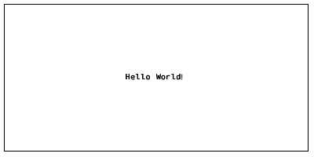
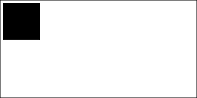
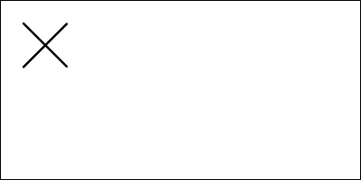
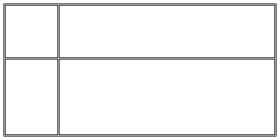
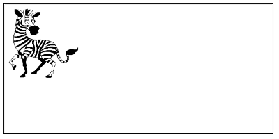

# @cula-technologies/tszpl

 

Generate ZPL II from TypeScript.
`^FX No more printer commands!`

```ts
import {
  Label,
  Text,
  FontFamily,
  FontFamilyName,
  Alignment,
  AlignmentValue,
  PrintDensity,
  PrintDensityName,
} from '@cula-technologies/tszpl';

const label = new Label();
label.printDensity = new PrintDensity(PrintDensityName['8dpmm']);
label.width = 100;
label.height = 50;

const text = new Text();
label.add(text);
text.text = 'Hello World!';
text.fontFamily = new FontFamily(FontFamilyName.D);
text.verticalAlignment = new Alignment(AlignmentValue.Center);
text.horizontalAlignment = new Alignment(AlignmentValue.Center);

const zpl: string = await label.generateZPL();
// ^XA
// ^FO10,205^AD,,,
// ^FB1000,1000,0,C,0
// ^FDHello World!\&^FS
// ^XZ
```



_Image above shows the printed label. `tszpl` itself emits the ZPL source only — render via printer or viewer._

> **Scope**: `tszpl` only **emits ZPL II source**. There is no client-side rasterizer, no canvas preview, no PNG/PDF output. To see what your label looks like, send the ZPL to a Zebra printer or paste it into an online viewer such as [Labelary](http://labelary.com/viewer.html).

## About

`tszpl` is a complete TypeScript rewrite of the excellent [JSZPL](https://github.com/DanieLeeuwner/JSZPL) library by [Daniel Leeuwner](https://github.com/DanieLeeuwner). The original JSZPL provided a clean, declarative model for composing ZPL II labels in JavaScript. `tszpl` keeps that model intact while modernizing the codebase: strict TypeScript types, async-only render API, ESM-first builds, and zero runtime dependencies.

The original JSZPL also shipped a client-side preview rasterizer (`generateBinaryImage`). `tszpl` deliberately **does not** include this — the library focuses on producing correct ZPL II source. Use a real printer or [Labelary](http://labelary.com/viewer.html) to see the rendered result.

Huge credit goes to the JSZPL project — without its design, layout engine, and font tables, this rewrite would not exist. If you ship products that print labels with `tszpl`, please consider [supporting the original author](https://www.paypal.com/donate/?hosted_button_id=BVBKNU8NHN2UN).

## Table of Contents

- [Features](#features)
- [Installation](#installation)
  - [Package managers](#package-managers)
  - [ESM / Node.js](#esm--nodejs)
  - [CommonJS](#commonjs)
- [TypeScript](#typescript)
- [Generating ZPL](#generating-zpl)
- [Bundle formats](#bundle-formats)
- Property Types
  - [Size](#size)
  - [PrintDensity](#printdensity)
  - [FontFamily](#fontfamily)
  - [Alignment](#alignment)
  - [Spacing](#spacing)
  - [GridPosition](#gridposition)
  - [BarcodeType](#barcodetype)
  - [Content](#content)
  - [GraphicData](#graphicdata)
- Elements
  - [Label](#label)
  - [Text](#text)
  - [Grid](#grid)
  - [Box](#box)
  - [Line](#line)
  - [Circle](#circle)
  - [Barcode](#barcode)
  - [Graphic](#graphic)
  - [SerialNumber](#serialnumber)
  - [UnicodeText](#unicodetext)
  - [Raw](#raw)
- [Differences from JSZPL](#differences-from-jszpl)
- [Contributing](#contributing)
- [Known Issues](#known-issues)
- [Roadmap](#roadmap)
- [License & Credits](#license--credits)

**WARNING**: This is not a complete implementation of the ZPL II standard. For elements not implemented (or whose implementation does not fit your needs), use the [Raw](#raw) component. If you believe there is a problem with a specific component, please open an issue.

[Link to ZPL II manual](https://www.zebra.com/content/dam/zebra/manuals/printers/common/programming/zpl-zbi2-pm-en.pdf)

## Features

- **ZPL II emitter** — single output: a ZPL II source string from `await label.generateZPL()`. No bitmap preview, no canvas rasterizer, no image export.
- **Declarative layout** — size elements in absolute, fractional, or relative units; nest them inside grids, boxes, and circles.
- **Strict TypeScript** — full type definitions ship with the package; the library itself is authored in TypeScript with `strict`, `noUncheckedIndexedAccess`, and `exactOptionalPropertyTypes` on.
- **Fonts A–F included** — bitmap glyphs are bundled; no external assets required. Font tables initialize lazily on first use.
- **Barcodes** — 1D and 2D including Code 39/93/128, EAN 8/13, UPC-E, PDF417, QR Code, DataMatrix, PostNet, and more.
- **Zero runtime dependencies**.
- **Works everywhere** — Node.js ≥ 18, modern browsers, Deno, Bun, any bundler.

## Installation

Requires Node.js ≥ 18 (for the ESM build) or any modern browser.

### Package managers

```sh
# npm
npm install @cula-technologies/tszpl

# pnpm
pnpm add @cula-technologies/tszpl

# yarn
yarn add @cula-technologies/tszpl

# bun
bun add @cula-technologies/tszpl
```

### ESM / Node.js

```ts
import {
  Label,
  Text,
  FontFamily,
  FontFamilyName,
  PrintDensity,
  PrintDensityName,
  Spacing,
} from '@cula-technologies/tszpl';

const label = new Label();
label.printDensity = new PrintDensity(PrintDensityName['8dpmm']);
label.width = 100;
label.height = 50;
label.padding = new Spacing(10);

const text = new Text();
label.add(text);
text.fontFamily = new FontFamily(FontFamilyName.D);
text.text = 'Hello World!';

console.log(await label.generateZPL());
```

### CommonJS

```ts
import type { Label as LabelType } from '@cula-technologies/tszpl';
const { Label, Text, FontFamily, FontFamilyName, PrintDensity, PrintDensityName, Spacing } =
  require('@cula-technologies/tszpl') as typeof import('@cula-technologies/tszpl');

(async () => {
  const label: LabelType = new Label();
  label.printDensity = new PrintDensity(PrintDensityName['8dpmm']);
  label.width = 100;
  label.height = 50;
  label.padding = new Spacing(10);

  const text = new Text();
  label.add(text);
  text.fontFamily = new FontFamily(FontFamilyName.D);
  text.text = 'Hello World!';

  console.log(await label.generateZPL());
})();
```

## TypeScript

Type declarations are bundled and picked up automatically — no separate `@types/cula-technologies__tszpl` needed.

```ts
import {
  Text,
  FontFamily,
  FontFamilyName,
  Alignment,
  AlignmentValue,
  type FontFamilyValue,
} from '@cula-technologies/tszpl';

function headerText(text: string, font: FontFamilyValue = FontFamilyName.D): Text {
  const t = new Text();
  t.text = text;
  t.fontFamily = new FontFamily(font);
  t.horizontalAlignment = new Alignment(AlignmentValue.Center);
  return t;
}
```

Every enum is both a `const` object and a derived union type (`FontFamilyValue`, `AlignmentValueType`, `BarcodeTypeValue`, `PrintDensityValue`, `SizeTypeValue`, `RotationValue`). Use the value for runtime, the type for signatures.

## Generating ZPL

Single output API. Async-only. No bitmap, no preview, no image export.

```ts
abstract class BaseComponent {
  abstract generateZPL(...args: unknown[]): Promise<string>;
}
```

```ts
const zpl: string = await label.generateZPL();
```

Extensions that need real async work (loading a TTF font, fetching a remote resource) override `generateZPL` directly:

```ts
import { Text } from '@cula-technologies/tszpl';

class RemoteFontText extends Text {
  override async generateZPL(...args: Parameters<Text['generateZPL']>): Promise<string> {
    await this.fontFamily.ensureLoaded();
    return super.generateZPL(...args);
  }
}
```

To preview the output, send the ZPL string to a Zebra printer or paste it into [Labelary](http://labelary.com/viewer.html). `tszpl` does not include a built-in renderer.

> **Migration from JSZPL** — sync `generateZPL()` and `generateBinaryImage()` (both sync and async variants) were removed in `tszpl`. Replace `generateZPL()` calls with `await label.generateZPL()`. The client-side preview rasterizer is gone — use a printer or [Labelary](http://labelary.com/viewer.html) instead. The legacy `generateXML()` stub was also dropped.

## Bundle formats

The published package contains the following bundle formats under `dist/`:

| File                         | Format | When it's used                                        |
| ---------------------------- | ------ | ----------------------------------------------------- |
| `dist/index.js`              | ESM    | `import` in Node.js / bundlers (via `exports.import`) |
| `dist/index.cjs`             | CJS    | `require()` in Node.js (via `exports.require`)        |
| `dist/index.d.ts` / `.d.cts` | Types  | TypeScript auto-resolves from `types`                 |

Source maps are published alongside every bundle.

## Property Types

Most properties are defined as their own object types, so the constructor name is visible rather than just `String`, `Number`, or `Object`.

#### Size

Size is used by width, height, column definition, and row definition properties. It takes a number and `SizeType` as constructor parameters.

`SizeType`:

```ts
const SizeType = {
  Absolute: 0, // exact size
  Fraction: 1, // size as fraction of parent
  Relative: 2, // size together with siblings as part of parent
  Auto: 3, // grid row only — size to measured content (UnicodeText). Async render required.
} as const;
```

Usage:

```ts
import { Grid, Size, SizeType } from '@cula-technologies/tszpl';

const grid = new Grid();
grid.width = new Size(250, SizeType.Absolute);
grid.columns.push(new Size(1, SizeType.Relative));
```

If only a number is supplied, it is interpreted as `SizeType.Absolute`. These three lines are equivalent:

```ts
grid.width = 250;
grid.width = new Size(250);
grid.width = new Size(250, SizeType.Absolute);
```

`SizeType.Fraction` requires the input value to be less than 1.

#### PrintDensity

`PrintDensity` is only used by the [Label](#label) element. It denotes the dot density of the output label. `Label` is also the only element whose `width` and `height` are measured in millimeters rather than dots.

`PrintDensityName`:

```ts
const PrintDensityName = {
  '6dpmm': 6,
  '8dpmm': 8,
  '12dpmm': 12,
  '24dpmm': 24,
} as const;
```

```ts
import { Label, PrintDensity, PrintDensityName } from '@cula-technologies/tszpl';

const label = new Label();
label.printDensity = new PrintDensity(PrintDensityName['8dpmm']);
```

#### FontFamily

`FontFamily` is used by the [Text](#text) element. It selects the font matrix used to render the element text. Only fonts A–F are implemented.

```ts
const FontFamilyName = {
  A: 'A',
  B: 'B',
  D: 'D',
  E: 'E',
  F: 'F',
} as const;
```

```ts
import { Text, FontFamily, FontFamilyName } from '@cula-technologies/tszpl';

const text = new Text();
text.fontFamily = new FontFamily(FontFamilyName.D);
```

Font definitions decode lazily on first access, so the initial import is cheap.

#### Alignment

`Alignment` is used by the [Text](#text) element on `horizontalAlignment` and `verticalAlignment` to align text within its parent container.

```ts
const AlignmentValue = {
  Start: 'Start',
  Center: 'Center',
  End: 'End',
} as const;
```

```ts
import { Text, Alignment, AlignmentValue } from '@cula-technologies/tszpl';

const text = new Text();
text.verticalAlignment = new Alignment(AlignmentValue.Center);
text.horizontalAlignment = new Alignment(AlignmentValue.Center);
```

#### Spacing

`Spacing` is used by `margin` and `padding` properties. It holds `left`, `top`, `right`, and `bottom` numeric values.

Constructors with 0, 1, 2, or 4 parameters:

```ts
import { Spacing } from '@cula-technologies/tszpl';

// 0 parameters — 0 on all sides
label.padding = new Spacing();

// 1 parameter — same value on all sides
label.padding = new Spacing(10);

// 2 parameters — left/right, top/bottom
label.padding = new Spacing(10, 20);

// 4 parameters — left, top, right, bottom
label.padding = new Spacing(10, 20, 30, 40);
```

#### GridPosition

`GridPosition` is used by all elements except [Label](#label). It has `column` and `row` properties that place the component within a [Grid](#grid) parent.

```ts
import { Grid, Text, FontFamily, FontFamilyName, Size, SizeType, Spacing } from '@cula-technologies/tszpl';

const grid = new Grid();
label.add(grid);
grid.columns.push(new Size(1, SizeType.Relative));
grid.columns.push(new Size(1, SizeType.Relative));
grid.rows.push(new Size(1, SizeType.Relative));
grid.rows.push(new Size(1, SizeType.Relative));
grid.columnSpacing = 2;
grid.rowSpacing = 2;
grid.border = 2;
grid.padding = new Spacing(10);

const text00 = new Text();
grid.add(text00);
text00.text = '(0, 0)';
text00.fontFamily = new FontFamily(FontFamilyName.D);

const text10 = new Text();
grid.add(text10);
text10.text = '(1, 0)';
text10.fontFamily = new FontFamily(FontFamilyName.D);
text10.grid.column = 1;

const text01 = new Text();
grid.add(text01);
text01.text = '(0, 1)';
text01.fontFamily = new FontFamily(FontFamilyName.D);
text01.grid.row = 1;

const text11 = new Text();
grid.add(text11);
text11.text = '(1, 1)';
text11.fontFamily = new FontFamily(FontFamilyName.D);
text11.grid.column = 1;
text11.grid.row = 1;
```


#### BarcodeType

`BarcodeType` is used by the [Barcode](#barcode) element.

```ts
const BarcodeTypeName = {
  Code11: 'Code11',
  Interleaved25: 'Interleaved25',
  Code39: 'Code39',
  PlanetCode: 'PlanetCode',
  PDF417: 'PDF417',
  EAN8: 'EAN8',
  UPCE: 'UPCE',
  Code93: 'Code93',
  Code128: 'Code128',
  EAN13: 'EAN13',
  Industrial25: 'Industrial25',
  Standard25: 'Standard25',
  ANSICodabar: 'ANSICodabar',
  Logmars: 'Logmars',
  MSI: 'MSI',
  Plessey: 'Plessey',
  QRCode: 'QRCode',
  DataMatrix: 'DataMatrix',
  PostNet: 'PostNet',
} as const;
```

```ts
import { Barcode, BarcodeType, BarcodeTypeName } from '@cula-technologies/tszpl';

const barcode = new Barcode();
barcode.type = new BarcodeType(BarcodeTypeName.Code11);
```

#### Content

Container elements expose an `add(...children)` method (returns `this`, fluent-friendly) and a read-only `children` getter. Child elements are positioned relative to their parent — if the parent moves, the children move with it.

Container elements:

- [Label](#label)
- [Box](#box)
- [Circle](#circle)
- [Grid](#grid)

```ts
import { Label, Text, Box } from '@cula-technologies/tszpl';

const label = new Label();
const text = new Text();
label.add(text);

const boxA = new Box();
const boxB = new Box();
const boxC = new Box();
label.add(boxA, boxB, boxC);

for (const child of label.children) {
  // read-only iteration
}
```

#### GraphicData

`GraphicData` is consumed by [Graphic](#graphic) to render an image. `data` holds the image bits, `width` and `height` hold the image's pixel dimensions.

```ts
class GraphicData {
  constructor(width?: number, height?: number, data?: readonly number[]);
}
```

An image processor must produce a black-and-white bit array (`1`s and `0`s). Browser example using Canvas:

```ts
import { Graphic, GraphicData } from '@cula-technologies/tszpl';

const graphic = new Graphic();

const image = new Image();
image.onload = (): void => {
  const canvas = document.createElement('canvas');
  canvas.width = image.width;
  canvas.height = image.height;

  const context = canvas.getContext('2d');
  if (!context) return;
  context.drawImage(image, 0, 0);

  const { data } = context.getImageData(0, 0, canvas.width, canvas.height);

  const imageBits: number[] = [];
  for (let i = 0; i < data.length; i += 4) {
    const r = data[i] ?? 0;
    const g = data[i + 1] ?? 0;
    const b = data[i + 2] ?? 0;
    const a = data[i + 3] ?? 0;
    const value = a !== 0 && (r + g + b) / 3 < 180 ? 1 : 0;
    imageBits.push(value);
  }

  graphic.data = new GraphicData(image.width, image.height, imageBits);
};
image.src = url;
```

For a Node.js example (using `pngjs`), see the `'add image to a label'` test case in [graphics.test.js](./tests/graphics.test.js).

## Elements

#### Label

The base container element within which other elements are placed.

| Property                        | Type                          | Description                                                      |
| :------------------------------ | :---------------------------- | :--------------------------------------------------------------- |
| `printDensity`                  | [PrintDensity](#printdensity) | Dot density (6/8/12/24 dpmm)                                     |
| `width`                         | Number                        | Width in mm (multiplied by `printDensity.value` at render time)  |
| `height`                        | Number                        | Height in mm (multiplied by `printDensity.value` at render time) |
| `padding`                       | [Spacing](#spacing)           | Reduces the area available to child elements                     |
| `add(...children)` / `children` | Method / Getter               | Child elements (use `add()` to append; iterate via `children`)   |

```ts
import {
  Label,
  Text,
  FontFamily,
  FontFamilyName,
  PrintDensity,
  PrintDensityName,
  Spacing,
} from '@cula-technologies/tszpl';

const label = new Label();
label.printDensity = new PrintDensity(PrintDensityName['8dpmm']);
label.width = 100;
label.height = 50;
label.padding = new Spacing(10);

const text = new Text();
label.add(text);
text.fontFamily = new FontFamily(FontFamilyName.D);
text.text = 'Hello World!';

const zpl: string = await label.generateZPL();
// ^XA
// ^FO10,10^AD,,,
// ^FB780,1000,0,L,0
// ^FDHello World!^FS
// ^XZ
```


#### Text

Displays characters on the label.

| Property              | Type                          | Description                                           |
| :-------------------- | :---------------------------- | :---------------------------------------------------- |
| `fontFamily`          | [FontFamily](#fontfamily)     | Font family matrix                                    |
| `verticalAlignment`   | [Alignment](#alignment)       | Default `AlignmentValue.Start`                        |
| `horizontalAlignment` | [Alignment](#alignment)       | Default `AlignmentValue.Start`                        |
| `fixed`               | Boolean                       | Position relative to the Label rather than the parent |
| `invert`              | Boolean                       | Invert color values                                   |
| `grid`                | [GridPosition](#gridposition) | Placement within a Grid parent                        |
| `margin`              | [Spacing](#spacing)           | Space around the element                              |
| `width`               | [Size](#size) / Number        | Uses parent width if omitted                          |
| `height`              | [Size](#size) / Number        | Uses parent height if omitted                         |
| `left`                | [Size](#size) / Number        | Left offset                                           |
| `top`                 | [Size](#size) / Number        | Top offset                                            |
| `lineSpacing`         | Number                        | Vertical space between lines                          |
| `text`                | String                        | The text                                              |
| `characterWidth`      | Number                        | Override the font's default character width           |
| `characterHeight`     | Number                        | Override the font's default character height          |

```ts
import { Text, FontFamily, FontFamilyName } from '@cula-technologies/tszpl';

const text = new Text();
label.add(text);
text.fontFamily = new FontFamily(FontFamilyName.D);
text.text = 'Hello World!';
```


#### Box

A rectangular shape.

| Property                        | Type                          | Description                                                    |
| :------------------------------ | :---------------------------- | :------------------------------------------------------------- |
| `fill`                          | Boolean                       | Fill the shape with a solid color                              |
| `cornerRadius`                  | Number                        | Rounded-corner radius                                          |
| `fixed`                         | Boolean                       | Position relative to the Label rather than the parent          |
| `invert`                        | Boolean                       | Invert color values                                            |
| `grid`                          | [GridPosition](#gridposition) | Placement within a Grid parent                                 |
| `margin`                        | [Spacing](#spacing)           | Space around the element                                       |
| `padding`                       | [Spacing](#spacing)           | Space inside the element                                       |
| `width`                         | [Size](#size) / Number        | Uses parent width if omitted                                   |
| `height`                        | [Size](#size) / Number        | Uses parent height if omitted                                  |
| `left`                          | [Size](#size) / Number        | Left offset                                                    |
| `top`                           | [Size](#size) / Number        | Top offset                                                     |
| `border`                        | Number                        | Border thickness (ignored if `fill` is set)                    |
| `add(...children)` / `children` | Method / Getter               | Child elements (use `add()` to append; iterate via `children`) |

```ts
import { Box } from '@cula-technologies/tszpl';

const box = new Box();
label.add(box);
box.fill = true;
box.width = 150;
box.height = 150;
```



#### Line

A straight line between two points.

| Property    | Type                          | Description                                           |
| :---------- | :---------------------------- | :---------------------------------------------------- |
| `fixed`     | Boolean                       | Position relative to the Label rather than the parent |
| `invert`    | Boolean                       | Invert color values                                   |
| `grid`      | [GridPosition](#gridposition) | Placement within a Grid parent                        |
| `margin`    | [Spacing](#spacing)           | Space around the element                              |
| `left`      | [Size](#size) / Number        | Left offset                                           |
| `top`       | [Size](#size) / Number        | Top offset                                            |
| `x1`        | Number                        | X of first point                                      |
| `y1`        | Number                        | Y of first point                                      |
| `x2`        | Number                        | X of second point                                     |
| `y2`        | Number                        | Y of second point                                     |
| `thickness` | Number                        | Line thickness                                        |

```ts
import { Line } from '@cula-technologies/tszpl';

const line1 = new Line();
label.add(line1);
line1.x1 = 50;
line1.y1 = 50;
line1.x2 = 150;
line1.y2 = 150;
line1.thickness = 5;
```



#### Circle

A circular (or elliptical) shape.

| Property                        | Type                          | Description                                                    |
| :------------------------------ | :---------------------------- | :------------------------------------------------------------- |
| `fill`                          | Boolean                       | Fill the shape with a solid color                              |
| `fixed`                         | Boolean                       | Position relative to the Label rather than the parent          |
| `invert`                        | Boolean                       | Invert color values                                            |
| `grid`                          | [GridPosition](#gridposition) | Placement within a Grid parent                                 |
| `margin`                        | [Spacing](#spacing)           | Space around the element                                       |
| `padding`                       | [Spacing](#spacing)           | Space inside the element                                       |
| `width`                         | [Size](#size) / Number        | Uses parent width if omitted                                   |
| `height`                        | [Size](#size) / Number        | Uses parent height if omitted                                  |
| `left`                          | [Size](#size) / Number        | Left offset                                                    |
| `top`                           | [Size](#size) / Number        | Top offset                                                     |
| `border`                        | Number                        | Border thickness (ignored if `fill` is set)                    |
| `add(...children)` / `children` | Method / Getter               | Child elements (use `add()` to append; iterate via `children`) |

When `width !== height`, an ellipse is drawn.

```ts
import { Circle } from '@cula-technologies/tszpl';

const circle = new Circle();
label.add(circle);
circle.fill = true;
circle.width = 150;
circle.height = 150;
```


#### Grid

A grid with column and row definitions.

| Property                        | Type                          | Description                                                    |
| :------------------------------ | :---------------------------- | :------------------------------------------------------------- |
| `fixed`                         | Boolean                       | Position relative to the Label rather than the parent          |
| `invert`                        | Boolean                       | Invert color values                                            |
| `grid`                          | [GridPosition](#gridposition) | Placement within a Grid parent                                 |
| `margin`                        | [Spacing](#spacing)           | Space around the element                                       |
| `padding`                       | [Spacing](#spacing)           | Space inside each cell                                         |
| `columnSpacing`                 | Number                        | Horizontal space between cells                                 |
| `rowSpacing`                    | Number                        | Vertical space between cells                                   |
| `width`                         | [Size](#size) / Number        | Uses parent width if omitted                                   |
| `height`                        | [Size](#size) / Number        | Uses parent height if omitted                                  |
| `left`                          | [Size](#size) / Number        | Left offset                                                    |
| `top`                           | [Size](#size) / Number        | Top offset                                                     |
| `border`                        | Number                        | Border thickness of each cell                                  |
| `columns`                       | `Array<Size \| number>`       | Column definitions                                             |
| `rows`                          | `Array<Size \| number>`       | Row definitions                                                |
| `add(...children)` / `children` | Method / Getter               | Child elements (use `add()` to append; iterate via `children`) |

```ts
import { Grid, Size, SizeType } from '@cula-technologies/tszpl';

const grid = new Grid();
label.add(grid);
grid.columns.push(new Size(150, SizeType.Absolute));
grid.columns.push(new Size(1, SizeType.Relative));
grid.rows.push(new Size(150, SizeType.Absolute));
grid.rows.push(new Size(1, SizeType.Relative));
grid.border = 2;
grid.columnSpacing = 2;
grid.rowSpacing = 2;
```



**Auto-sized rows.** A row defined as `new Size(0, SizeType.Auto)` measures the [UnicodeText](#unicodetext) children placed inside it and resizes the row to `max(measured text height) + grid.padding.vertical`. Width passed to `autoBreak` is the resolved column width minus padding/border. Non-`UnicodeText` children in an Auto row are ignored for measurement.

```ts
import { Grid, GridPosition, Size, SizeType, Spacing, UnicodeText } from '@cula-technologies/tszpl';

grid.padding = new Spacing(8);
grid.columns.push(new Size(1, SizeType.Relative));
grid.rows.push(new Size(0, SizeType.Auto)); // sized to text
grid.rows.push(new Size(1, SizeType.Relative)); // fills remainder

const text = new UnicodeText({ text: '...', printerFontName: 'TT0003M_.TTF', fontUrl: '...' });
text.autoBreak = true;
text.grid = new GridPosition(0, 0);
grid.add(text);

const zpl: string = await label.generateZPL();
```

#### Barcode

Renders a barcode.

| Property             | Type                          | Description                                                |
| :------------------- | :---------------------------- | :--------------------------------------------------------- |
| `fixed`              | Boolean                       | Position relative to the Label rather than the parent      |
| `grid`               | [GridPosition](#gridposition) | Placement within a Grid parent                             |
| `margin`             | [Spacing](#spacing)           | Space around the element                                   |
| `width`              | [Size](#size) / Number        | Uses parent width if omitted                               |
| `height`             | [Size](#size) / Number        | Uses parent height if omitted                              |
| `left`               | [Size](#size) / Number        | Left offset                                                |
| `top`                | [Size](#size) / Number        | Top offset                                                 |
| `type`               | [BarcodeType](#barcodetype)   | Barcode type                                               |
| `data`               | String                        | Text to encode                                             |
| `maxLength`          | Number                        | Expected maximum data length (2D barcode sizing hint)      |
| `subset`             | String                        | Subset indicator — `'A'`, `'B'`, or `'C'` for Code 128     |
| `interpretationLine` | Boolean                       | Whether to render the interpretation line (default `true`) |

```ts
import { Barcode, BarcodeType, BarcodeTypeName } from '@cula-technologies/tszpl';

const barcode = new Barcode();
label.add(barcode);
barcode.data = '5901234123457';
barcode.type = new BarcodeType(BarcodeTypeName.EAN13);
barcode.width = 200;
barcode.height = 50;
```

#### Graphic

Displays an image.

| Property | Type                          | Description                                           |
| :------- | :---------------------------- | :---------------------------------------------------- |
| `fixed`  | Boolean                       | Position relative to the Label rather than the parent |
| `invert` | Boolean                       | Invert color values                                   |
| `grid`   | [GridPosition](#gridposition) | Placement within a Grid parent                        |
| `margin` | [Spacing](#spacing)           | Space around the element                              |
| `width`  | [Size](#size) / Number        | Uses parent width if omitted                          |
| `height` | [Size](#size) / Number        | Uses parent height if omitted                         |
| `left`   | [Size](#size) / Number        | Left offset                                           |
| `top`    | [Size](#size) / Number        | Top offset                                            |
| `border` | Number                        | Border thickness around the image                     |
| `data`   | [GraphicData](#graphicdata)   | Image data                                            |



#### SerialNumber

Prints an auto-incrementing number on each label the printer renders.

| Property              | Type                          | Description                                               |
| :-------------------- | :---------------------------- | :-------------------------------------------------------- |
| `fontFamily`          | [FontFamily](#fontfamily)     | Font family matrix                                        |
| `horizontalAlignment` | [Alignment](#alignment)       | Default `AlignmentValue.Start`                            |
| `grid`                | [GridPosition](#gridposition) | Placement within a Grid parent                            |
| `format`              | String                        | Starting value (e.g. `'A0001'`) — non-numeric prefix kept |
| `increment`           | Number                        | Amount added per label; negative to decrement (default 1) |
| `printLeadingZeroes`  | Boolean                       | Preserve leading zeros in the format (default `true`)     |
| `characterWidth`      | Number                        | Override the font's default character width               |
| `characterHeight`     | Number                        | Override the font's default character height              |

```ts
import { SerialNumber, FontFamily, FontFamilyName } from '@cula-technologies/tszpl';

const serialNum = new SerialNumber();
label.add(serialNum);
serialNum.fontFamily = new FontFamily(FontFamilyName.D);
serialNum.format = 'A0001';
serialNum.increment = 2;
serialNum.printLeadingZeroes = true;

const zpl: string = await label.generateZPL();
// ^XA
// ^FO10,10^AD,,,
// ^FB780,1000,0,L,0
// ^SNA0001,2,Y^FS
// ^XZ
```

#### UnicodeText

Renders text using a custom TTF font uploaded to the printer (ZPL `^A@` font reference). Use this instead of [Text](#text) when characters fall outside the bundled fonts (CJK, extended Latin, Cyrillic, etc.). Requires the printer to already host the named TTF on a font drive (default `E:`).

Async-only — overrides only `generateZPL`. Render the parent label with `generateZPL()`. Browser/DOM environment required (uses `FontFace` + canvas for measurement).

| Property              | Type                          | Description                                                                       |
| :-------------------- | :---------------------------- | :-------------------------------------------------------------------------------- |
| `text`                | String (constructor)          | The text to render. Supports `\n` for line breaks                                 |
| `printerFontName`     | String (constructor)          | Filename of the TTF on the printer (e.g. `'TT0003M_.TTF'`)                        |
| `fontUrl`             | String (constructor)          | URL or base64 data URL of the TTF file used for client-side measurement           |
| `verticalAlignment`   | [Alignment](#alignment)       | Default `AlignmentValue.Start`                                                    |
| `horizontalAlignment` | [Alignment](#alignment)       | Default `AlignmentValue.Start`                                                    |
| `invert`              | Boolean                       | Invert color values                                                               |
| `grid`                | [GridPosition](#gridposition) | Placement within a Grid parent                                                    |
| `margin`              | [Spacing](#spacing)           | Space around the element                                                          |
| `width`               | [Size](#size) / Number        | Uses parent width if omitted                                                      |
| `height`              | [Size](#size) / Number        | Uses parent height if omitted                                                     |
| `left`                | [Size](#size) / Number        | Left offset                                                                       |
| `top`                 | [Size](#size) / Number        | Top offset                                                                        |
| `characterHeight`     | Number                        | Font size in dots (default `22`)                                                  |
| `characterWidth`      | Number                        | Font width in dots (default `0` = auto from height)                               |
| `lineSpacing`         | Number                        | Extra vertical space between lines                                                |
| `autoBreak`           | Boolean                       | Wrap input text to fit available width using canvas measurement (default `false`) |

```ts
import { Label, UnicodeText, PrintDensity, PrintDensityName } from '@cula-technologies/tszpl';

const label = new Label();
label.printDensity = new PrintDensity(PrintDensityName['8dpmm']);
label.width = 100;
label.height = 50;

const text = new UnicodeText({
  text: 'Größe: 中文 / Δοκιμή',
  printerFontName: 'TT0003M_.TTF',
  fontUrl: '/fonts/NotoSans.ttf', // or 'data:font/ttf;base64,...'
});
text.characterHeight = 28;
text.autoBreak = true;
label.add(text);

const zpl: string = await label.generateZPL();
```

Pair with `SizeType.Auto` grid rows ([see Grid](#grid)) for layouts where row height follows the wrapped text.

Non-ASCII bytes are emitted via the ZPL `^FH` hex escape (`_C3_BC`-style) so the printer reproduces the UTF-8 sequence exactly.

#### Raw

Emits raw ZPL. `Raw` inherits from `BaseComponent` and has no layout options.

| Property | Type   | Description                      |
| :------- | :----- | :------------------------------- |
| `data`   | String | Raw ZPL data to add to the label |

```ts
import { Raw } from '@cula-technologies/tszpl';

const raw = new Raw();
label.add(raw);
raw.data = `^FO50,50^GB100,100,100^FS
^FO75,75^FR^GB100,100,100^FS
^FO93,93^GB40,40,40^FS`;

console.log(await label.generateZPL());
// ^XA
// ^FO50,50^GB100,100,100^FS
// ^FO75,75^FR^GB100,100,100^FS
// ^FO93,93^GB40,40,40^FS
// ^XZ
```


## Differences from JSZPL

If you are migrating from [`jszpl`](https://github.com/DanieLeeuwner/JSZPL):

- **Package name**: `jszpl` → `@cula-technologies/tszpl`. Update imports.
- **No client-side preview rasterizer**: `generateBinaryImage()` (and its `BinaryImage` / `BarcodeRenderer` types) is gone in every component. `tszpl` is a ZPL II emitter, not a renderer. Use a Zebra printer or [Labelary](http://labelary.com/viewer.html) to preview.
- **Async-only output API**: `generateZPL()` returns `Promise<string>`. Sync variants and the legacy `generateXML()` were removed.
- **TypeScript-first**: bundled `.d.ts` types, strict compiler flags, enums exposed as both `const` objects and derived union types.
- **ESM-first packaging**: dual ESM + CJS builds via `exports`. No UMD or CDN distribution — use a bundler.
- **`UnicodeText` element**: new in `tszpl`, renders with custom printer-resident TTF fonts via `^A@`.
- **`SizeType.Auto`**: new auto-sizing grid row mode that measures `UnicodeText` children.

The component model, layout semantics, and ZPL output are intentionally compatible with the original where features overlap.

## Contributing

```sh
# install (pnpm recommended; npm/yarn also work)
pnpm install

# run the vitest suite
pnpm test

# run tests in watch mode
pnpm test:watch

# typecheck only (no emit)
pnpm typecheck

# lint / lint with auto-fix
pnpm lint
pnpm lint:fix

# prettier check / write
pnpm format
pnpm format:fix

# build all bundle formats into dist/
pnpm build
```

The codebase is strict TypeScript (`strict`, `noUncheckedIndexedAccess`, `exactOptionalPropertyTypes`, `noImplicitOverride`, `verbatimModuleSyntax`). Lint runs typed linting from `typescript-eslint`. Prettier formats source.

## Known Issues

| Feature                   | Notes                                                                           |
| :------------------------ | :------------------------------------------------------------------------------ |
| Invert                    | Not implemented correctly by all controls                                       |
| Grid Columnspan           | Pending implementation                                                          |
| Grid Rowspan              | Pending implementation                                                          |
| Rotation                  | Pending implementation                                                          |
| Fonts                     | Fonts A–F are implemented; G–V are not                                          |
| Multi-line text alignment | Alignment is not applied across lines within a single text element              |
| Grid border property      | The graphical designer does not display the border property for grid components |
| Text size override        | The graphical designer does not support text size overriding                    |

## Roadmap

| Feature | Notes                                                                               |
| :------ | :---------------------------------------------------------------------------------- |
| Stack   | Stack elements based on set size or minimum size — direction horizontal or vertical |

## License & Credits

Licensed under **GPL-3.0** — same license as the upstream JSZPL project.

`tszpl` is a TypeScript rewrite of [JSZPL](https://github.com/DanieLeeuwner/JSZPL) by [Daniel Leeuwner](https://github.com/DanieLeeuwner). All original design decisions, the layout engine, font tables, and component model originate there. This package would not exist without that work.

If `tszpl` is useful to you, please consider [supporting Daniel](https://www.paypal.com/donate/?hosted_button_id=BVBKNU8NHN2UN), the original author.
